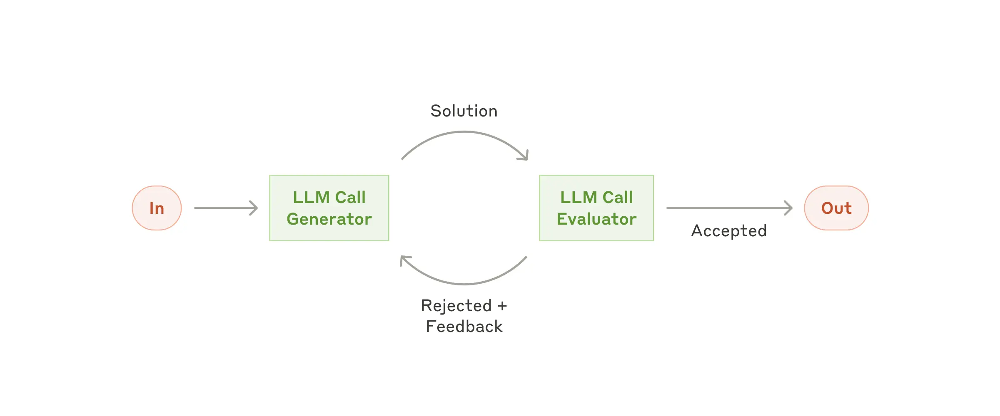

# pydantic-ai-researcher

## Description
pydantic-ai-researcher is a research system that orchestrates an asynchronous loop between two specialized agents: a research agent and an evaluator agent. The research agent answers complex queries using external MCP servers, while the evaluator agent assesses and refines these answers, iterating until a satisfactory response is attained.

## Features
- **Asynchronous Research Loop**: Iterative evaluation and improvement of research answers.
- **Dual Agent System**: Utilizes a research agent for data gathering and an evaluator agent for feedback.
- **Pluggable MCP Servers**: Integrates with multiple MCP servers (Tavily, Brave Search, arXiv) for diverse data sources.
- **Environment Configurable**: Uses environment variables and .env files for API key configuration.
- **Easy Setup**: Straightforward installation via Pipfile or requirements.txt.

## Installation / Setup
1. **Prerequisites**: Ensure Python 3.x is installed.
2. **Installation**:
   - Using Pipenv:
     ```bash
     pipenv install
     ```
   - Or using pip:
     ```bash
     pip install -r requirements.txt
     ```
3. **Configuration**:
   - Create a `.env` file at the project root.
   - Define the required environment variables:
     - `OPENAI_API_KEY`
     - `TAVILY_API_KEY`
     - `BRAVE_API_KEY`
   - (Other API endpoints may also need to be defined as needed.)

## Usage
Run the project by executing the following command:
```bash
python main.py
```
Type your research queries in the interactive prompt. To exit the program, type `exit`.

## Architecture
The system implements a two-agent evaluator-optimizer loop:
- **Agent A (Research Agent)**: Generates initial answers to research queries using external data sources via MCP servers.
- **Agent B (Evaluator Agent)**: Evaluates the answers provided by Agent A and offers feedback for improvement.
- **Loop Mechanism**: The system iterates through multiple cycles of evaluation until an answer is accepted or the maximum iteration limit is reached.

Below is the workflow diagram illustrating the evaluator-optimizer process:



Source: [Building effective agents](https://www.anthropic.com/engineering/building-effective-agents)

## Configuration

The project configuration relies on environment variables loaded via `python-dotenv`. Ensure that:
- `OPENAI_API_KEY` is set for the OpenAI model usage.
- `TAVILY_API_KEY` is set for accessing Tavily MCP Search.
- `BRAVE_API_KEY` is set for using Brave Search MCP.
- Additional configuration for arXiv MCP may be defined as needed.

## Contributing / License
Contributions are welcome. Please submit issues and pull requests for bug fixes, improvements, or new features. Refer to the project's [LICENSE](LICENSE) file for licensing details.